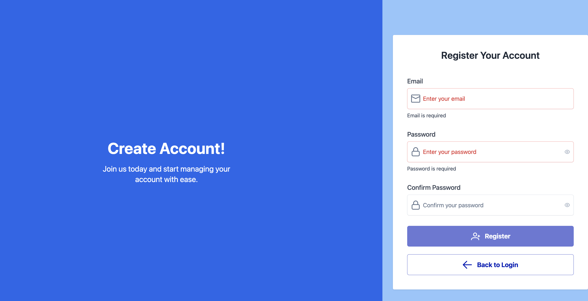
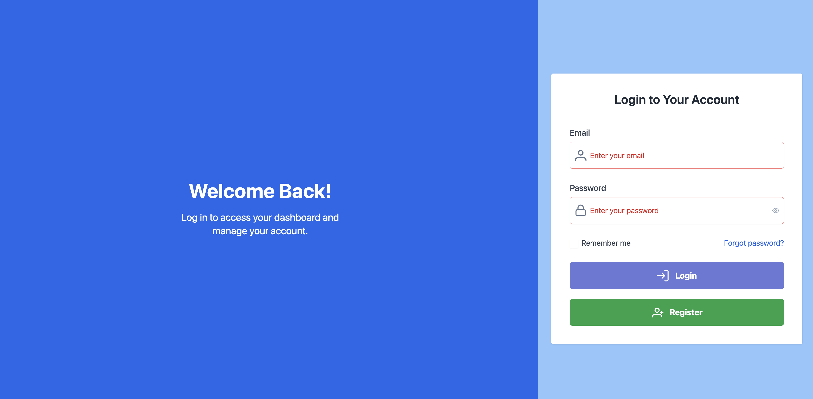
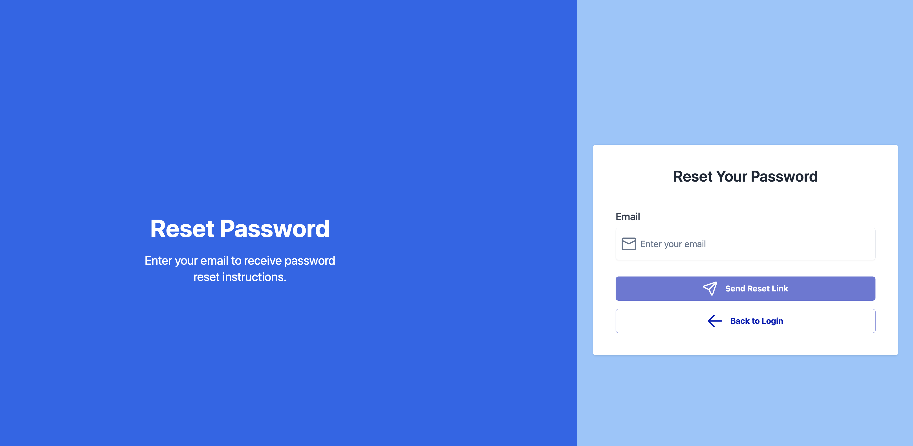
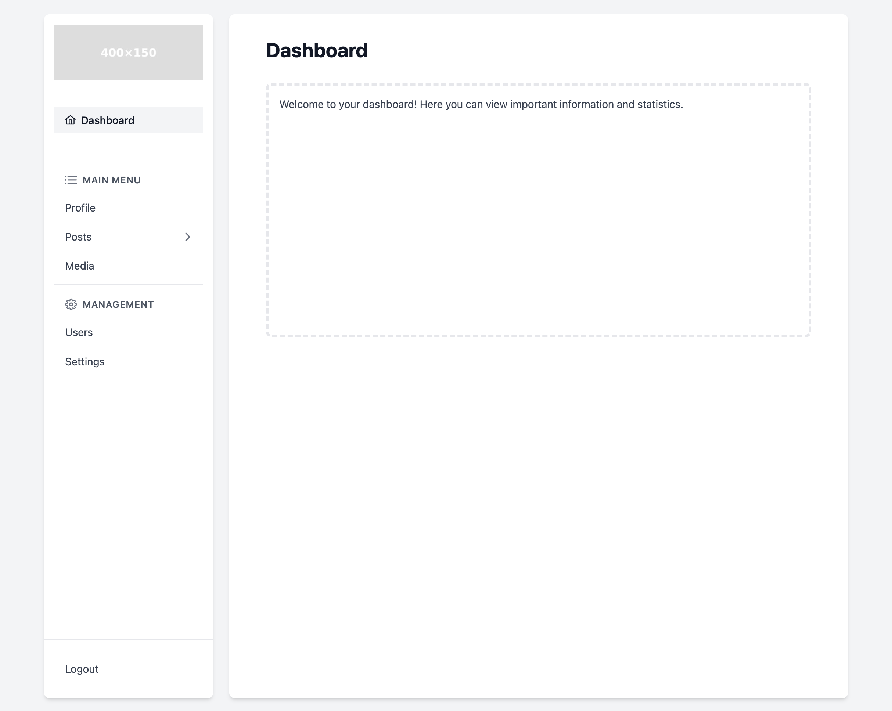

# 🚀 AngularFire Starter Template With TailwindUI And PrimeNG
This is a comprehensive Angular Starter template designed to kickstart your next web application development project.
## 📦 Stack
- [Angular 18](https://angular.io/)
- [AngularFire 18](https://firebase.google.com/)
- [PrimeNG 18](https://primeng.org/)
- [Tailwind CSS](https://tailwindcss.com/) / [PrimeNG UI](https://primeng.org/)
- [PrimeIcons](https://primeng.org/icons)
- [Firebase](https://firebase.google.com/)

## ✨ Features 
- Login
- Registration
- Password Reset
- Dashboard

Auth managed by Firebase Auth


## 🎨 User Interface
- Mobile Responsive
- Hamburger Menu
- Container Layout

## 🖼️ Screenshots

### *Registration*


### *Login*


### *Reset*


### *Dashboard*



### *Versions*
Node v20.9.0 <br>
ng 18.2.12


# Getting Started
```
## Clone the Repo
git clone 

## Install Dependencies
npm install 

## Run
ng serve
```
### Questions? Comments? Praise?
Reach out on Twitter [@notmilobejda](https://x.com/notmilobejda)
